# JTT808-809协议的IOV开发测试模拟平台

<div align="center">
  
  
  [](https://www.oracle.com/java/)
  [](https://spring.io/projects/spring-boot)
  [](LICENSE)
  []()
</div>

## 目录

- [项目简介](#-项目简介)
- [核心特性](#-核心特性)
- [快速开始](#-快速开始)
  - [环境要求](#环境要求)
  - [安装运行](#安装运行)
  - [访问界面](#访问界面)
- [功能特性](#-功能特性)
  - [已实现功能](#已实现功能)
  - [开发中功能](#开发中功能)
- [技术架构](#-技术架构)
  - [核心技术栈](#核心技术栈)
  - [架构设计](#架构设计)
- [使用指南](#-使用指南)
  - [线路管理](#1-线路管理)
  - [任务创建](#2-任务创建)
  - [实时监控](#3-实时监控)
- [开发指南](#-开发指南)
- [性能指标](#-性能指标)
- [系统界面展示](#-系统界面展示)

## 📖 项目简介

基于JTT808-809协议的IOV开发测试平台,包含808终端模拟，jtt809协议下级平台转发服务，用于测试和开发车联网平台，专为车联网平台的测试和开发而设计。通过模拟真实车辆的行驶轨迹、停留、报警触发等行为，帮助开发者进行部标服务器的压力测试和业务逻辑验证。

### 🎯 核心特性

- 🚗 **真实轨迹模拟** - 基于百度地图API生成真实的行驶路线
- 🔄 **高并发支持** - 基于Netty实现，支持大规模终端连接
- 📊 **实时监控** - Web界面实时监控车辆状态和轨迹
- 🛠️ **灵活配置** - 支持多种参数配置和自定义扩展
- 📝 **详细日志** - 完整的协议交互日志，便于调试
- 🎛️ **Web管理** - 友好的Web界面管理线路和任务

## 🚀 快速开始

### 环境要求

- Java 8+
- Maven 3.6+
- 内存 512MB+

### 安装运行

```

```

### 访问界面

启动成功后，访问 [http://localhost:8091](http://localhost:8888) 进入管理界面。

## 📋 功能特性

### ✅ 已实现功能

- [x] **协议支持** - JT/T808 2013版本协议完整实现
- [x] **并发连接** - 基于Netty的高性能网络通信
- [x] **轨迹模拟** - 智能路径规划和轨迹随机化
- [x] **实时监控** - Web界面实时显示车辆状态
- [x] **数据存储** - H2数据库存储路线和任务数据
- [x] **日志记录** - 详细的协议交互日志
- [x] **809转发** - JT/T809协议下级平台数据转发
- [x] **平台对接** - 支持与上级监管平台对接
- [x] **车辆设备管理** - 统一管理模拟车辆设备信息
- [x] **网关管理** - 支持网关配置和状态监控

### 🔄 开发中功能

- [ ] **JT/T808 2019** - 新版本协议支持
- [ ] **JT/T1078** - 音视频传输协议支持
- [ ] **参数配置** - 0x8103指令参数动态配置
- [ ] **批量测试** - 大规模压力测试工具
- [ ] **报警模拟** - 各类报警事件模拟
- [ ] **设备远程控制** - 支持远程控制车辆设备
- [ ] **数据分析报表** - 提供数据分析和可视化报表
- [ ] **多协议网关** - 支持多种协议的统一网关管理

## 🏗️ 技术架构

### 核心技术栈

- **Spring Boot 2.3.12** - 应用框架，提供自动配置和快速开发能力
- **Netty 4.1.42** - 高性能网络通信框架，用于实现JTT808协议通信
- **MyBatis Plus 3.4.3** - 数据持久化框架，简化数据库操作
- **H2 Database 1.4.197** - 嵌入式数据库，用于存储路线和任务数据
- **FreeMarker** - 模板引擎，用于生成动态页面内容
- **Bootstrap** - 前端UI框架，构建响应式用户界面
- **Redis** - 缓存系统，用于存储设备状态和会话信息
- **Fastjson 1.2.83** - 高性能JSON处理库，用于数据序列化和反序列化
- **Apache Commons Pool2** - 对象池化技术，提升资源利用率
- **Lombok 1.18.20** - Java库，简化代码编写，减少样板代码
- **JSoup 1.10.2** - Java HTML解析器，用于处理HTML文档

### 架构设计

```
┌─────────────────┐    ┌─────────────────┐    ┌─────────────────┐
│   Web管理界面    │    │   JTT808协议层   │    │   车辆终端模拟   │
├─────────────────┤    ├─────────────────┤    ├─────────────────┤
│ 线路管理        │    │ 消息编解码      │    │ 位置上报        │
│ 任务创建        │    │ 协议验证        │    │ 轨迹模拟        │
│ 实时监控        │    │ 消息路由        │    │ 状态管理        │
│ 设备管理        │    │ 会话管理        │    │ 报警模拟        │
└─────────────────┘    └─────────────────┘    └─────────────────┘
         │                       │                       │
         └───────────────────────┼───────────────────────┘
                                 │
                    ┌─────────────────┐    ┌─────────────────┐
                    │   数据存储层     │    │   JTT809网关层   │
                    ├─────────────────┤    ├─────────────────┤
                    │ 路线数据        │    │ 上下级平台通信  │
                    │ 任务信息        │    │ 数据转发        │
                    │ 日志记录        │    │ 协议转换        │
                    │ 配置管理        │    │ 状态监控        │
                    └─────────────────┘    └─────────────────┘
                                 │                       │
                                 └───────────────────────┘
                                             │
                                ┌─────────────────────┐
                                │   系统管理层         │
                                ├─────────────────────┤
                                │ 任务调度            │
                                │ 资源监控            │
                                │ 日志分析            │
                                │ 配置中心            │
                                └─────────────────────┘
```

## 📚 使用指南

### 1. 线路管理

创建车辆行驶线路，设置关键参数：

- **起终点设置** - 通过地图选择起点和终点
- **速度控制** - 设置最高/最低行驶速度
- **停留点配置** - 添加中途停留点和停留时间
- **轨迹优化** - 自动优化路径并随机化轨迹点

### 2. 任务创建

基于已创建的线路创建模拟任务：

```
车牌号：京A12345
终端ID：123456789012345
SIM卡号：13800138000
服务器地址：192.168.1.100:8080
```

### 3. 实时监控

- **轨迹监控** - 实时查看车辆行驶轨迹
- **状态监控** - 监控车辆状态位和报警位
- **消息日志** - 查看详细的协议交互记录

## 🔧 开发指南


## 📊 性能指标

- **并发连接数** - 支持10万+终端同时在线
- **消息处理** - 每秒处理10万+条消息
- **内存占用** - 单个终端约1KB内存
- **响应时间** - 平均响应时间<10ms

## 🖼️ 系统界面展示

以下是系统主要功能界面的截图展示：

<table>
  <tr>
    <td align="center">
      <strong>1. 主界面</strong><br>
      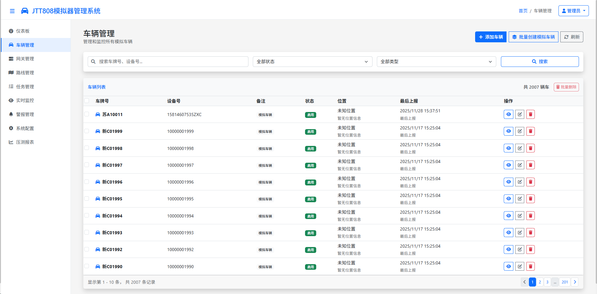<br>
      主界面
    </td>
    <td align="center">
      <strong>主界面</strong><br>
      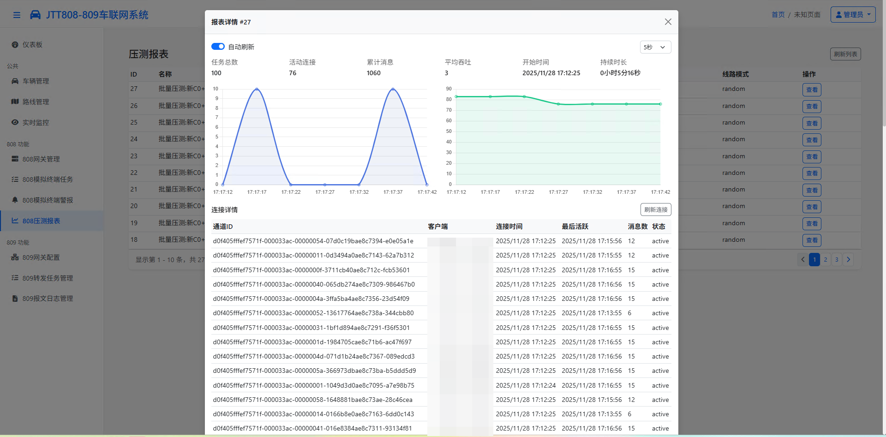<br>
      主界面
    </td>
    <td align="center">
      <strong>2. 线路管理界面</strong><br>
      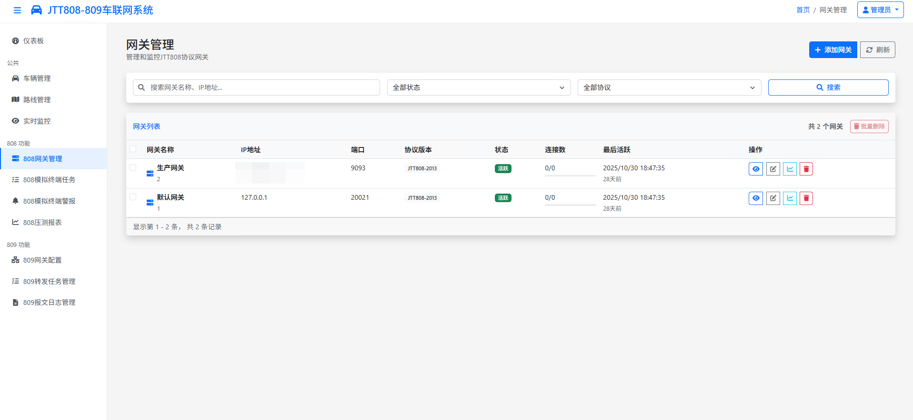<br>
      线路管理
    </td>
  </tr>
  <tr>
    <td align="center">
      <strong>3. 任务创建界面</strong><br>
      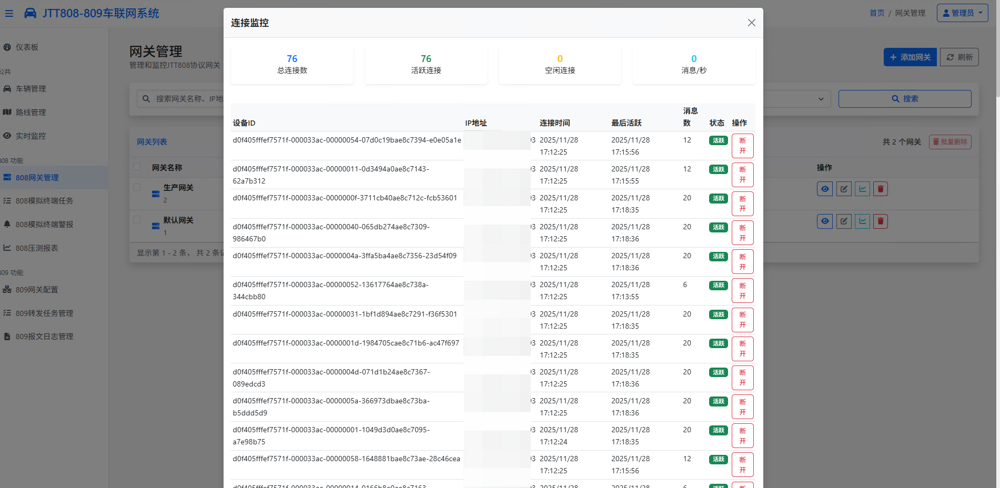<br>
      任务创建
    </td>
    <td align="center">
      <strong>4. 实时监控界面</strong><br>
      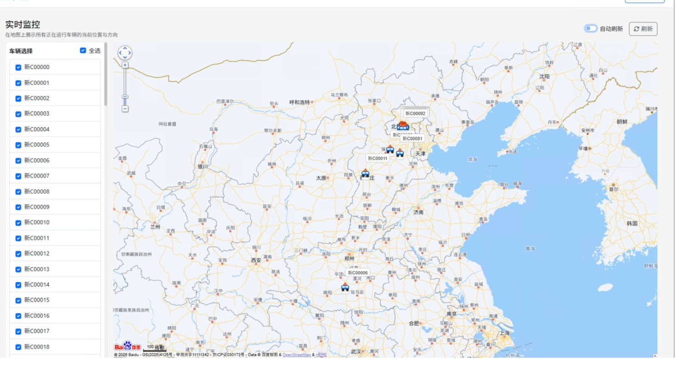<br>
      实时监控
    </td>
    <td align="center">
      <strong>5. 808报文界面</strong><br>
      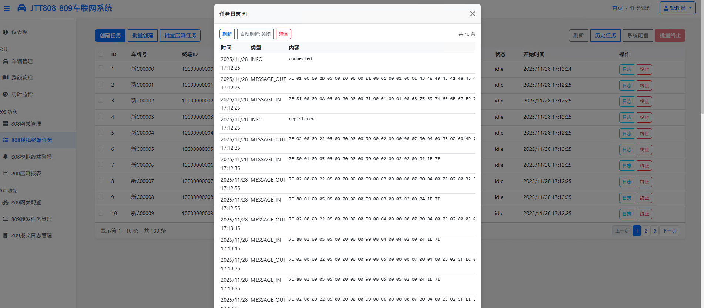<br>
      车辆轨迹
    </td>
  </tr>
  <tr>
    <td align="center">
      <strong>6. 网关管理界面</strong><br>
      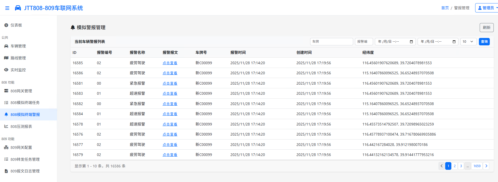<br>
      网关管理
    </td>
    <td align="center">
      <strong>7. 设备管理界面</strong><br>
      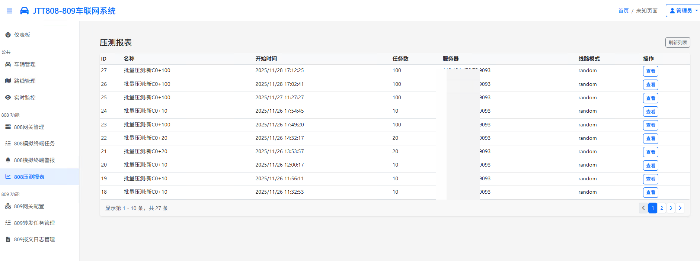<br>
      设备管理
    </td>
    <td align="center">
      <strong>8. 日志查看界面</strong><br>
      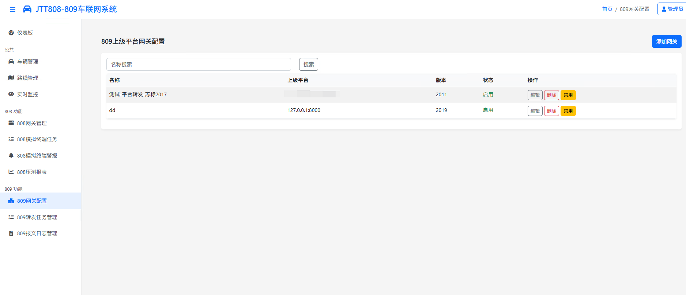<br>
      日志查看
    </td>
  </tr>
  <tr>
    <td align="center">
      <strong>9. 系统配置界面</strong><br>
      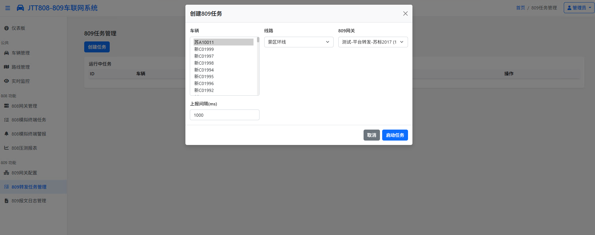<br>
      系统配置
    </td>
    <td align="center">
      <strong>10. 报表统计界面</strong><br>
      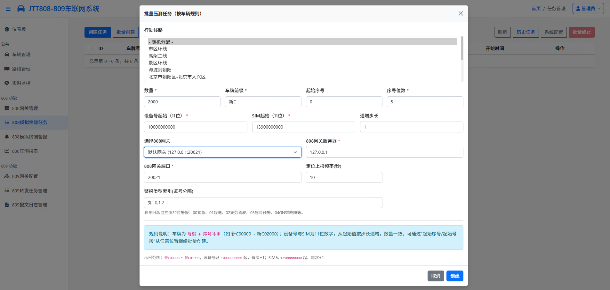<br>
      报表统计
    </td>
    <td align="center">
      <strong>11. 报警信息展示</strong><br>
      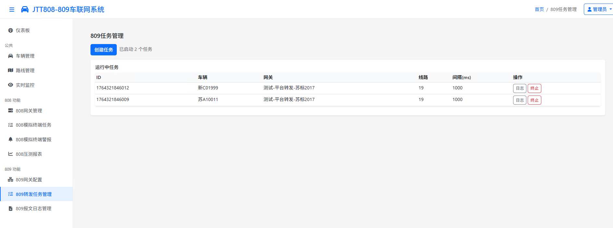<br>
      报警信息
    </td>
  </tr>
  <tr>
    <td align="center">
      <strong>12. 数据分析界面</strong><br>
      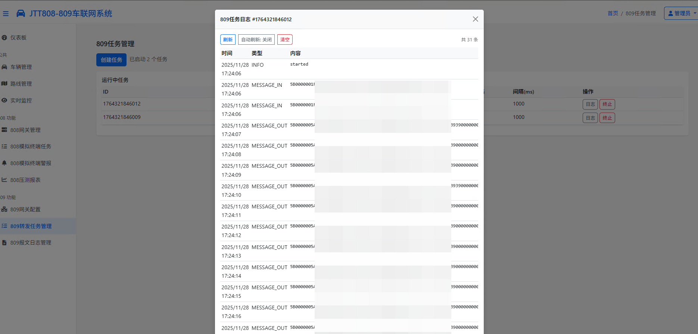<br>
      数据分析
    </td>
    <td align="center">
      <strong>13. 809报文界面</strong><br>
      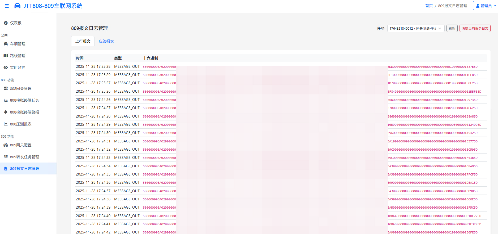<br>
      系统状态
    </td>
 <td align="center">
      <strong>14. 线路管理</strong><br>
      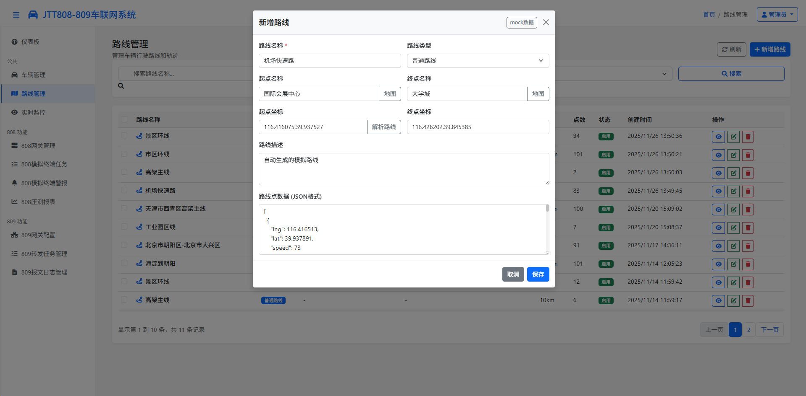<br>
      线路管理
    </td>
  </tr>
 <tr>
    <td align="center">
      <strong>15. 批量创建模拟车辆</strong><br>
      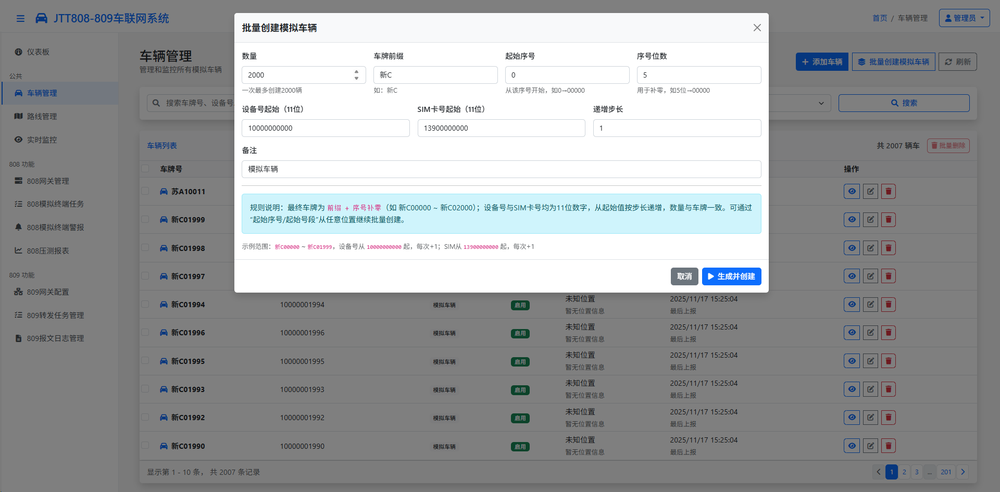<br>
      批量创建模拟车辆
    </td>
  </tr>
</table>

## 参考项目
- https://github.com/SmallChi/JT809
- https://github.com/glaciall/jtt808-simulator
